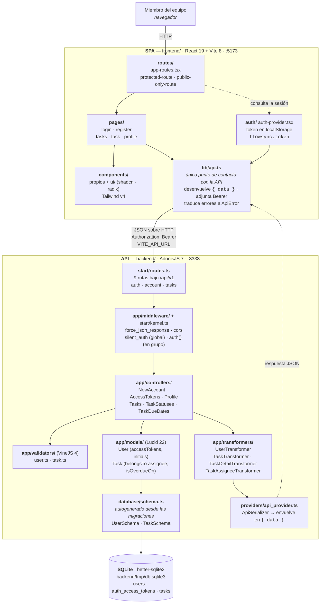

# Arquitectura de FlowSync

Este diagrama es el nivel de **contenedores** de C4 —las piezas que se arrancan y despliegan por separado: la SPA de React, la API de AdonisJS y el fichero SQLite— con el detalle de los componentes internos de cada una, porque en un monorepo de dos procesos el nivel de contenedores a secas serían tres cajas y no explicaría nada. Se lee de arriba abajo siguiendo el camino de una petición: el navegador entra por una ruta de `react-router`, `lib/api.ts` es el único sitio del frontend que habla con la API, y en el backend cada petición pasa por el router, la cadena de middleware, un controlador, un validador de VineJS, un modelo de Lucid y un transformer antes de que el serializer la envuelva en `{ data: ... }`. Todo lo dibujado sale de leer los archivos del repo; lo que no se ha podido verificar en el código no está.

## Notas de lectura

- **`lib/api.ts` es de verdad el único punto de contacto.** No hay ninguna llamada a `fetch` en el resto de `frontend/src/`.
- **El frontend no consume los tipos generados del backend.** `backend/.adonisjs/client/registry/` existe y está versionado, pero nada de `frontend/` lo importa: la SPA declara su propia forma de los datos a mano en `src/lib/types.ts`. Por eso no hay ninguna flecha entre los dos, y por eso los dos lados pueden desincronizarse sin que nada falle al compilar.
- **`database/schema.ts` se genera, no se escribe** (`schemaGeneration.enabled` en `config/database.ts`). Los modelos no declaran columnas: extienden la clase generada. Por eso la flecha va del modelo al esquema y del esquema a la base de datos.
- **Dos guards de auth configurados, uno en uso.** `config/auth.ts` define `api` (access tokens opacos, el `default`) y `web` (sesión). El guard `web` no aparece usado en ningún sitio de `app/` ni de `start/`, así que no está dibujado.
- **Una sola conexión a la base de datos, sin override por entorno.** Los tests functional pegan contra el mismo fichero SQLite que el servidor de desarrollo; de ahí que las suites se aíslen con transacción global.
- **El puerto de la SPA es el de por defecto de Vite.** `vite.config.ts` no fija `server.port`.
